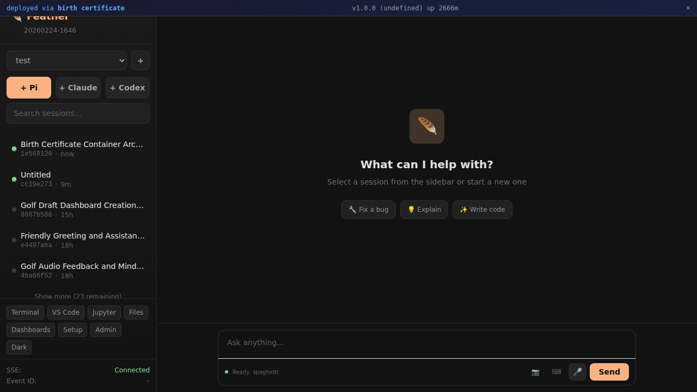

# Feather

**Your AI, your way.** One container with every AI coding agent, a real-time session viewer, terminals, voice input, and a full dev workspace. Deploy anywhere in one command.

Feather is a unified frontend for [Claude Code](https://docs.anthropic.com/en/docs/claude-code), [Codex](https://github.com/openai/codex), and [Pi](https://github.com/anthropics/pi) — all running side by side, streaming in real time, in a single environment you fully control.

> Software shouldn't be frozen at release. Feather is built to be changed — by you, by agents, by whatever comes next.



## Get Started

**One command, any Ubuntu VPS:**

```bash
git clone https://github.com/inceptel/feather.git /opt/feather-src
podman build -t feather /opt/feather-src
podman run -d -p 8080:8080 -v feather-data:/home/user feather
```

Open `http://your-ip:8080`. That's it.

**Production deploy with TLS and zero-downtime updates:**

```bash
# 1. Clone the run script (lives outside the feather repo)
git clone https://github.com/inceptel/run.git /opt/run  # or just copy run.sh + config.env

# 2. Configure
cp /opt/run/config.env.example /opt/run/config.env
# Edit config.env: set DOMAIN, API keys, etc.

# 3. Deploy
sudo /opt/run/run.sh install
```

This installs podman, builds everything, hardens the server (UFW, fail2ban, SSH lockdown, auto-updates), and starts Feather behind Caddy with automatic TLS. Updates are zero-downtime: `sudo /opt/run/run.sh update`.

## What You Get

A single container running:

| Tool | What it does |
|------|-------------|
| **Feather** | Session viewer, real-time streaming, terminal access, voice input |
| **Claude Code** | Anthropic's CLI coding agent |
| **Codex** | OpenAI's coding agent |
| **Pi** | Alternative coding agent |
| **JupyterLab** | Notebooks at `/jupyter/` |
| **tmux** | Terminal multiplexer for background sessions |
| **Caddy** | Reverse proxy with automatic HTTPS |
| **Full dev env** | Rust, Node.js, Python, git, vim, htop — everything |

All AI agents write sessions to disk. Feather watches them all, normalizes every format into a common schema, and streams everything to the browser in real time.

## Features

- **Unified session viewer** — Browse and search across Claude, Codex, and Pi sessions in one place
- **Real-time streaming** — SSE-based live tailing with byte-offset tracking. Watch agents think.
- **Terminal access** — Spawn and interact with any coding agent via embedded xterm.js
- **Voice input** — Dictate prompts via Whisper transcription. Talk to your agents.
- **Image upload** — Drag-and-drop screenshots into conversations
- **Session memory** — Automatic extraction and persistence of context across sessions
- **Zero-downtime deploys** — Blue-green container swaps with atomic Caddy upstream switching
- **Everything persists** — `/home/user` is a volume. Your data survives restarts, updates, and swaps.

## Architecture

```
Host VPS
  └── Birth Certificate (outer container)
        ├── Caddy (TLS, reverse proxy, port 80/443)
        ├── Podman (manages inner container lifecycle)
        └── Work Container (swappable, blue-green)
              ├── Caddy (internal routing, :8080)
              ├── Feather server (Rust/axum, :4850)
              ├── Claude Code CLI
              ├── Codex CLI
              ├── Pi agent
              ├── JupyterLab (:8888)
              └── supervisord (process management)

Persistent volume: /home/user (sessions, config, credentials, code)
```

Feather is a Rust (axum) server with a single-file frontend (`static/index.html`, ~4000 lines). Sessions from all AI agents are watched via filesystem notifications and normalized into `~/sessions/{uuid}.jsonl`:

- **Claude CLI** → `~/.claude/projects/` (JSONL conversation logs)
- **Codex** → `~/.codex/sessions/` (JSON session files)
- **Pi** → `~/.pi/agent/sessions/` (tree-structured JSONL with parentId chains)

The frontend connects via Server-Sent Events for live updates. Terminal sessions run in tmux and stream via WebSocket + xterm.js.

## Environment Variables

Set in `config.env` (production) or pass with `-e` (local):

| Variable | Description |
|----------|-------------|
| `FEATHER_ANTHROPIC_API_KEY` | Anthropic API key — powers title generation, memory extraction |
| `FEATHER_OPENAI_API_KEY` | OpenAI API key — Whisper voice transcription |
| `ANTHROPIC_API_KEY` | Passed to Claude Code sessions inside the container |
| `OPENAI_API_KEY` | Passed to Codex sessions inside the container |
| `FEATHER_PASSWORD` | Simple auth password (recommended for remote) |
| `DOMAIN` | Your domain for automatic TLS (production) |
| `ACME_EMAIL` | Email for Let's Encrypt certificates |

## Production Deploy

The `run.sh` script handles everything for production:

```bash
sudo ./run.sh install    # Full setup: podman, hardening, build, start
sudo ./run.sh update     # Pull latest, rebuild, zero-downtime swap
sudo ./run.sh status     # Service status, container info
sudo ./run.sh logs       # Follow service logs
```

**What `install` does:**
1. Installs podman from upstream repos
2. Hardens the server (UFW firewall, fail2ban, SSH lockdown, unattended security upgrades)
3. Clones Feather, builds the container images
4. Creates a systemd service with automatic restart
5. Starts everything behind Caddy with TLS

**What `update` does:**
1. Pulls latest code from GitHub
2. Rebuilds the work container image
3. Triggers a zero-downtime blue-green swap inside the running birth container
4. Zero dropped requests during the switch

## Local Development

```bash
# Build and run locally
podman build -t feather .
podman run -p 8080:8080 -v ~/feather-data:/home/user feather

# Or with Docker
docker build -f Containerfile -t feather .
docker run -p 8080:8080 -v ~/feather-data:/home/user feather
```

## Philosophy

Feather exists because every AI coding tool has its own UI, its own session format, its own way of doing things. We think you should be able to use all of them — together, in one place, without vendor lock-in.

The entire frontend is a single HTML file. The backend is ~5000 lines of Rust. There's no build step, no webpack, no framework. You can read the whole thing, change anything, and deploy in seconds.

This is software that's meant to be modified.

## License

[Elastic License 2.0 (ELv2)](LICENSE) — free to use, modify, and self-host. Cannot be offered as a managed service.
