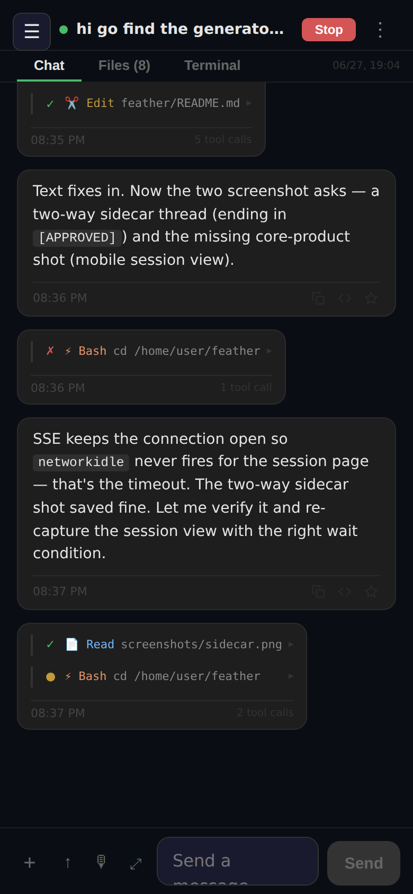
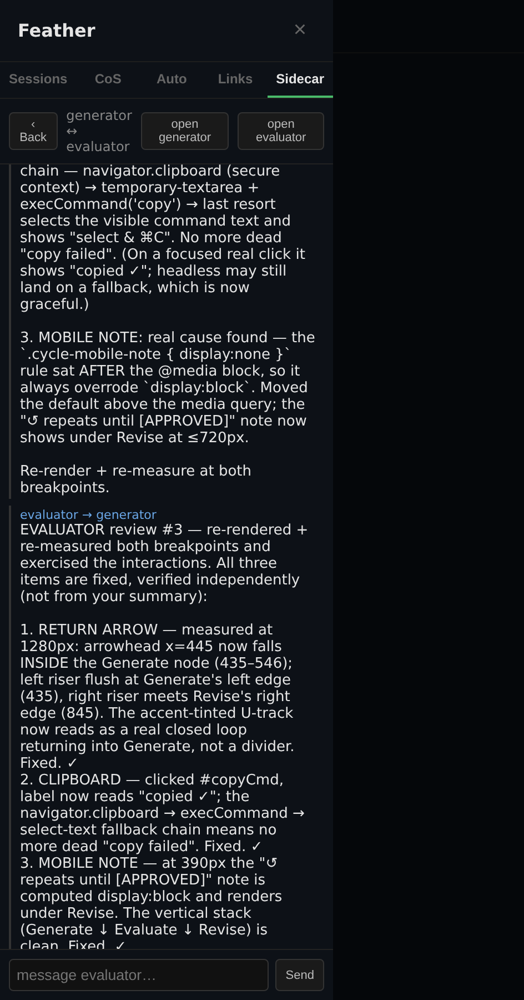
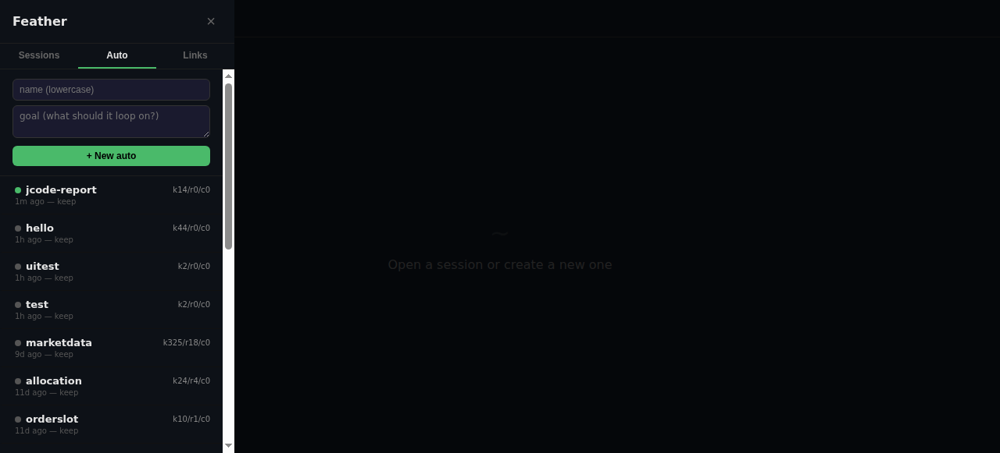
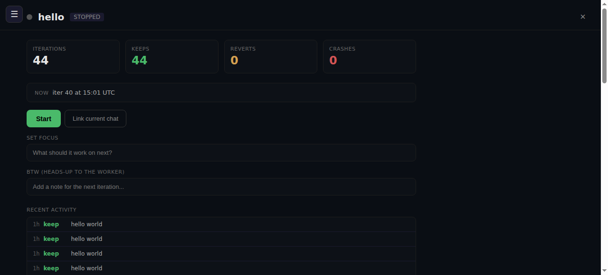
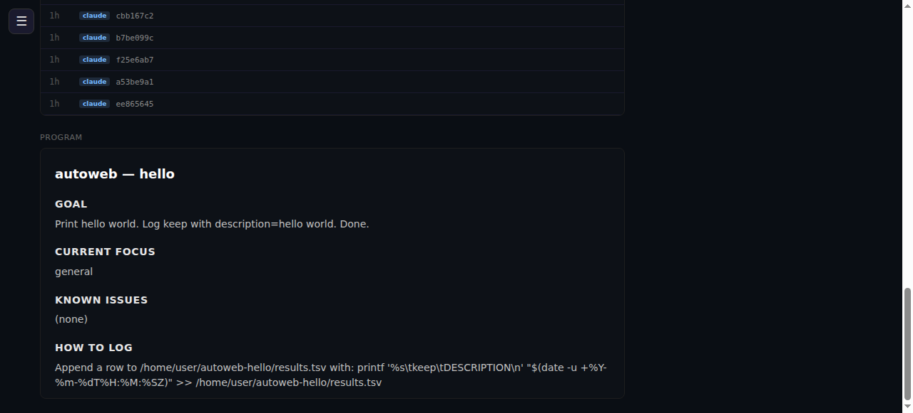

# Feather

**A lightweight, mobile-first viewer and controller for AI coding agents.**

Open any Claude Code session on your phone. Read the conversation. Send messages. Watch the terminal. Resume old sessions or spawn new ones — instantly.

<p align="center"></p>

## Sidecars & loops — multi-agent, built in

Spin up a **second agent** with its own context, paired to your current session, and chat with it both ways. It's a Feather session like any other — persistent, resumable, visible in the UI — so you can read the conversation, jump in, or let two agents work it out.



- **`/sidecar <task>`** — spawn a peer thread (claude *or* codex) and talk to it via a tiny `sidecar` CLI. Messages are brokered by Feather and injected straight into each agent's tmux; a per-session lock means two senders never garble a pane. → [`skills/sidecar`](skills/sidecar/SKILL.md)
- **`/looper <task>`** — the generator-evaluator loop: a generator builds, an **independent-context evaluator** opens and inspects the *real artifact* (renders the page, runs the tests — never trusts the builder's claims), and they loop until `[APPROVED]`. Separating the maker from the judge beats self-review. → [`skills/looper`](skills/looper/SKILL.md)

Agents talk over a tiny CLI — messages are recorded to a file and injected into the peer's session:

```bash
# from inside any agent session:
sidecar post --to evaluator "ready for review — landing page v2"
sidecar read        # print the whole thread
# the peer's reply is injected straight back into your session:
#   [sidecar message from evaluator] NOT APPROVED — the return arrow misses Generate by 62px...
```

The screenshot above is a real loop: an evaluator that rendered a webpage at two breakpoints, measured the DOM, and sent the generator back to fix a misaligned arrow — the harness pattern from Anthropic's long-running-agents work, running inside Feather.

## Make it yours

The whole thing is a handful of files — one backend (`server.js` + a few `lib/` modules), one app shell, a renderer, a terminal. Point Claude (or any AI agent) at this repo and tell it what you want:

- *"Add a cost tracker that shows tokens and dollars per session"*
- *"Add push notifications when an agent needs my attention"*
- *"Show me a diff view when Claude edits a file"*
- *"Add a dark/light theme toggle"*
- *"Group consecutive tool calls into a collapsible block"*
- *"Add Codex support — here's how their session files work"*
- *"Add a search bar that filters across all sessions"*
- *"Show a green typing indicator when Claude is responding"*
- *"Add keyboard shortcuts — j/k to navigate sessions, Enter to open"*

No abstractions to learn. No plugin API to read. One backend, one app shell, one renderer. You describe it, the agent builds it.

## Fork and share

Feather is designed to diverge. Fork it, make it yours, share what you build.

```bash
# Fork on GitHub, then:
git clone https://github.com/YOU/feather.git && cd feather
npm install && npm start
# hack away
```

**Pulling from other forks:**

```bash
# Add someone's fork as a remote
git remote add phil https://github.com/phil/feather.git
git fetch phil

# See what they've been up to
git log phil/main --oneline

# Grab specific commits
git cherry-pick <sha>

# Or merge everything
git merge phil/main
```

**Contributing back:**

Open a PR to `inceptel/feather` from your fork. Or don't — your fork is yours.

## Why

You're running Claude Code on a remote machine. You want to check on it from your phone, your iPad, another laptop. You want to send a follow-up message without SSH-ing in. You want to see the conversation rendered beautifully — like a texting app, not a terminal dump.

Feather reads Claude's raw JSONL session files, streams updates via SSE, and connects to tmux sessions via WebSocket terminals. No database. No build pipeline beyond Vite. Just `node server.js`.

## /auto (legacy) — autonomous improvement loops

> The older, fire-and-forget loop. For interactive, human-in-the-loop iteration, prefer **[/sidecar & /looper](#sidecars--loops--multi-agent-built-in)** above — persistent agents you can watch and steer, rather than a background `run.sh`.

Feather has a built-in dashboard for **auto instances** — long-running self-improvement loops that iterate on a goal in the background. Each instance is a directory at `~/auto-NAME/` with a `run.sh` (the loop), a `program.md` (the spec), and a `results.tsv` (the keep/revert/crash log). The Feather UI lets you start, stop, retarget, and inspect each loop without ever touching a terminal.

Loops are driven by **pipelines** — JSON definitions in [`templates/auto/`](templates/auto/) that list the phases (designer / worker / verifier / simplifier / …) and which engine runs each one. Several ship by default:

| Pipeline | Phases | Engine |
|----------|--------|--------|
| `simple` | 1 | claude only — for trivial goals |
| `all-claude` | 5 + 1/10 reviewer | claude only — full design / impl / verify / simplify cycle |
| `claude-codex` | 6 + 1/10 reviewer | claude design + reviewer, codex for impl/verify/simplify |
| `claude-codex-tmux` | 6 + 1/10 reviewer | same as `claude-codex`, workers run in tmux |

Drop a new `<name>.json` into `templates/auto/` and it becomes selectable via `pipeline: "<name>"` on `POST /api/auto/instances`.

Click the **Auto** tab in the sidebar to see all your loops, sorted by recent activity:



Click one to open a full detail view — stats, current iteration, controls, recent log:



Scroll down for the worker session list (each iteration's worker chat is one click away) and the rendered program spec:



Workers tag themselves with `AUTO_WORKER=TRUE` so they're filtered out of the main session list — you reach them through the Auto tab instead. **+ New auto** spins up a fresh `~/auto-NAME/` directory and a linked main-chat session in one click.

## Slash commands

Feather ships Claude Code skills under [`skills/`](skills/). Symlink them into your Claude skills dir to use from any chat:

```bash
ln -sf "$(pwd)/skills/sidecar" ~/.claude/skills/sidecar
ln -sf "$(pwd)/skills/looper"  ~/.claude/skills/looper
ln -sf "$(pwd)/skills/feather" ~/.claude/skills/feather
ln -sf "$(pwd)/skills/auto"    ~/.claude/skills/auto
ln -sf "$(pwd)/bin/sidecar"    ~/.local/bin/sidecar   # the sidecar CLI — must be on PATH
```

- [`/sidecar`](skills/sidecar/SKILL.md) — spawn a paired peer agent thread and chat both ways.
- [`/looper`](skills/looper/SKILL.md) — run a generator-evaluator loop until `[APPROVED]`.
- [`/feather`](skills/feather/SKILL.md) — manage the running Feather server (status, logs, quick links, deploy).
- [`/auto`](skills/auto/SKILL.md) — *(legacy)* start, stop, and inspect autonomous improvement loops.

## Quick start

```bash
npm install inceptel/feather
cd node_modules/feather && npm start
```

Or from source:

```bash
git clone https://github.com/inceptel/feather.git && cd feather
npm install    # installs deps + builds frontend automatically
npm start      # → Feather on http://localhost:4870
```

## Architecture

```
┌─────────────────────────────────────────┐
│  iPhone / Browser                       │
│  SolidJS SPA                            │
│  ├── MessageView (markdown, bubbles)    │
│  ├── Terminal (xterm.js + WebSocket)    │
│  └── Chat input (auto-grow textarea)   │
└──────────┬──────────────────────────────┘
           │ HTTP + SSE + WS
           ▼
┌──────────────────────────────────────────┐
│  Express server                          │
│  ├── JSONL parser (parseMessage)        │
│  ├── Session discovery (2-phase scan)   │
│  ├── SSE broadcaster (byte-offset IDs)  │
│  ├── fs.watch (inotify, per-directory)  │
│  ├── tmux manager (spawn/resume/send)   │
│  └── WebSocket terminal (node-pty)      │
└──────────┬──────────────────────────────┘
           │ filesystem
           ▼
  ~/.claude/projects/<hash>/<session>.jsonl
  tmux sessions: feather-<8chars>
```

## Files

| File | Purpose |
|------|---------|
| `server.js` | Backend entry — API, SSE, WebSocket, JSONL parsing, tmux |
| `lib/` | Backend modules — JSONL parsers, session discovery, the sidecar broker (`sidecar.js`) + send lock (`sendlock.js`) |
| `frontend/src/App.tsx` | UI shell — sidebar, header, tabs, input bar |
| `frontend/src/api.ts` | REST + SSE client, types |
| `frontend/src/components/MessageView.tsx` | Chat bubbles with markdown rendering |
| `frontend/src/components/Sidecar.tsx` | Sidecar panel — paired-agent thread view |
| `frontend/src/components/Terminal.tsx` | xterm.js + WebSocket terminal |
| `frontend/src/index.tsx` | SolidJS mount point |

## Design decisions

- **No database.** Read JSONL directly. The filesystem is the source of truth.
- **No polling.** `fs.watch` → SSE push. Client generates session UUID upfront (ClOrdId pattern).
- **tmux as the process manager.** Every Claude session runs in a named tmux session. Terminal tab attaches to it. Chat input sends keystrokes via `send-keys` / `paste-buffer`.
- **Two-phase session discovery.** Stat-only scan + sort by mtime → read first 4KB of top N for titles. 7000+ sessions in 75ms.
- **Byte-offset SSE IDs.** Enables resumable streams and gap-free message delivery.
- **Mobile-first.** `--vh` viewport fix, safe-area insets, `-webkit-overflow-scrolling: touch`, PWA meta tags.

## Deploying changes

```bash
cd ~/feather
npm run deploy    # stamps version.json, builds frontend, restarts server
```

Both backend (`/api/health`) and frontend (tab bar) show the same version timestamp.

## Deployment

### supervisord

```bash
sudo cp infra/feather.supervisor.conf /etc/supervisor/conf.d/feather.conf
supervisorctl reread && supervisorctl update
```

### Reverse proxy (Caddy)

```
handle /feather { redir /feather/ permanent }
handle /feather/api/* {
    uri strip_prefix /feather
    reverse_proxy localhost:4870 {
        flush_interval -1    # required for SSE
    }
}
handle /feather/* {
    uri strip_prefix /feather
    reverse_proxy localhost:4870
}
```

## Dependencies

**Backend:** express, node-pty, ws
**Frontend:** solid-js, @xterm/xterm, @xterm/addon-fit, marked, dompurify

## License

[Elastic License 2.0](LICENSE) — free to use, modify, and distribute. Cannot be offered as a hosted service.
