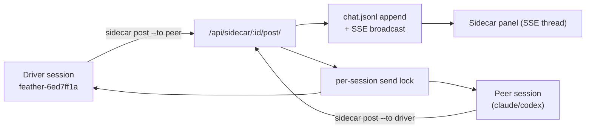
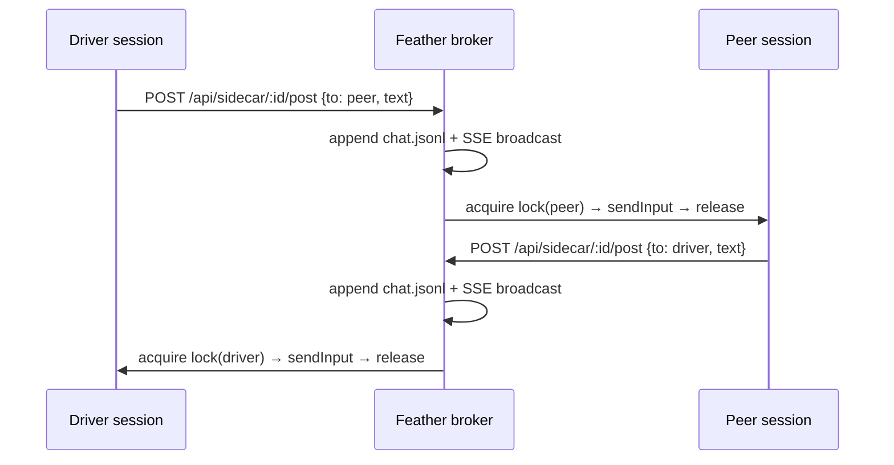

# Sidecar - Plan

> **Product Contract preservation:** unchanged. The three Outstanding Questions in the Product Contract (post transport, interaction style, default priming) are resolved in Key Technical Decisions below; no product scope changed.

## Goal Capsule

- **Objective:** Add a `/sidecar` primitive — spawn another agent thread, with its own independent context, paired to the current Claude Code session, that you can chat with back and forth. A small, reusable building block, brokered by the Feather backend.
- **Product authority:** Allan (a personal Feather capability).
- **Scope guard:** Sidecar is *just* "another thread to chat with." It is **not** the generator-evaluator / GAN looper (evaluator role, grading dimensions, `contract.md`, argue-until-approved). That harness is the first **consumer** built on top of sidecar and is a separate plan. Keeping sidecar generic is the point.
- **Open blockers:** None.

---

## Product Contract

### Problem

Sometimes you want a **second, independent thread** — its own fresh context — to bounce ideas off, hand a subtask to, or argue with, while keeping the current session focused. Today there is no first-class way to spawn a peer agent and chat with it bidirectionally; you'd hand-roll brittle tmux/file plumbing each time. Sidecar makes "spin up a peer thread and talk to it" a primitive. (Motivating consumer, *out of scope here*: a generator-evaluator loop needs an independent-context critic — one application of the primitive, not the primitive.)

### Actors

- **Current session** — the Claude Code session the user is driving (itself a Feather tmux session, e.g. `feather-6ed7ff1a`). The initiator / driver.
- **Sidecar** — a spawned peer agent thread with its **own independent context**. A peer, no fixed role. Defaults to `claude`; can be a different model (`codex`) for a less-correlated second brain.
- **Coordinator** — the Feather backend (long-lived, supervised), acting as broker between sidecar members.

### What we're building

`/sidecar [task]` — pairs the current session with one peer thread and brokers bidirectional chat through the Feather backend. One file (`chat.jsonl`) per group is the durable record; a first-class sidecar group entity (`members` is a **list**, `role` a free string); a GUI panel; a model knob.

### Primary flows

1. **Spawn:** `/sidecar [task]` registers a sidecar group with Feather; Feather spawns the peer as an interactive agent in its own tmux session and primes it with how to use the `sidecar` CLI + the optional `[task]`.
2. **Chat (push, blast-anytime):** A side runs `sidecar post --to <role>`; Feather appends to `chat.jsonl`, broadcasts to the GUI, and injects the message into the recipient's tmux. The recipient replies the same way. No turn gating.
3. **Teardown:** User dismisses the sidecar; Feather kills the peer tmux session and marks the group done. `chat.jsonl` persists.

### Scope boundaries

**In scope (v1):** single peer sidecar; bidirectional chat brokered by Feather (HTTP post-in, tmux inject-out, file as record); `chat.jsonl` per group; sidecar group entity with a `members` list; per-session send **lock**; a GUI thread panel; the `sidecar` CLI; the `/sidecar` skill; model knob (claude default, codex optional).

**Deferred for later (design for N, build for 1):** 2 → 20 sidecars (the lock already makes concurrent injection safe; address-by-name and members-list already in v1 shapes); broadcast / room addressing (`to: all-peers`); richer GUI (dual side-by-side terminals, multi-node graph); durable/persisted message queue.

**Outside this product's identity (belongs to consumers):** the generator-evaluator / GAN looper (`contract.md`, grading dimensions, argue-until-`[APPROVED]`) — a separate plan that *uses* a sidecar; a persistent **planner** process; headless `claude --print` orchestration (we use interactive tmux sessions).

---

## Key Technical Decisions

- **KTD1 — A sidecar member is a regular Feather session.** The peer is spawned with the existing `spawnSession()` (`server.js:598`); it appears in the normal session list, has its own JSONL, and is resumable. "Sidecar" is a *group + chat channel* layered over ordinary sessions — no new session type. Maximum reuse, minimum new surface.
- **KTD2 — Transport is HTTP-in (resolves Product Contract OQ "post transport").** `sidecar post` → `POST /api/sidecar/:id/post`. Feather appends to `chat.jsonl` (durable record), broadcasts over SSE (live GUI, mirroring `sessionStreamHandler` `server.js:990`), and routes to the recipient. No file-tail race; the GUI is fed for free.
- **KTD3 — Delivery is push, blast-anytime (resolves OQ "interaction style").** Routed messages go straight into the recipient's tmux via the existing send path. No idle gating — a reply may land mid-turn; the agent absorbs it as queued input. Push works in both directions.
- **KTD4 — Per-session send LOCK, not a queue.** A global per-session async mutex wraps the `sendInput()` critical section (`server.js:711-750`) so two senders can't interleave bytes into the same pane. Different sessions still send concurrently; the same session serializes. This — not idle-detection — is what makes N concurrent senders safe. No delivery scheduling.
- **KTD5 — The `sidecar` CLI self-identifies via its tmux session name.** It runs `tmux display-message -p '#S'` → `feather-<id8>`, and the group resolves `--to <role>` to a member session. This works identically for the pre-existing driver session and for spawned peers, with no env-var threading at spawn time.
- **KTD6 — State layout.** Group registry in `sidecars.json` at repo root (mirrors `readMeta/writeMeta` `server.js:272-281`); per-group `chat.jsonl` under `~/.feather/sidecars/<id>/` (mirrors the `auto` per-instance dir pattern).
- **KTD7 — Priming (resolves OQ "default priming").** On spawn, Feather injects an initial message into the peer: its role, how to use `sidecar post`, and the optional `[task]`. Generic by default; consumers override.

---

## High-Level Technical Design

Component shape — Feather brokers; members are plain sessions behind the send lock:



One ping-pong exchange (note the lock serialises injection, not turns):



---

## Output Structure

```
feather/
  server.js                          # (modify) send lock + /api/sidecar/* routes
  lib/sidecar.js                     # (new) group store + broker logic
  bin/sidecar                        # (new) the CLI; symlink → ~/.local/bin/sidecar
  frontend/src/components/Sidecar.tsx # (new) thread panel
  frontend/src/api.ts                # (modify) sidecar client fns
  frontend/src/App.tsx               # (modify) sidecar view + sidebar entry
  skills/sidecar/SKILL.md            # (new) /sidecar skill
  test/sidecar.test.js               # (new) backend tests
```

---

## Implementation Units

### U1. Per-session send lock

- **Goal:** Guarantee that concurrent senders never interleave bytes into the same tmux pane.
- **Requirements:** KTD4. Foundation for blast-anytime push (flow 2) and N-safety.
- **Dependencies:** none.
- **Files:** `server.js`, `test/sidecar.test.js`.
- **Approach:** Introduce a global `Map<sessionId, Promise>` lock chain. Wrap the body of `sendInput()` (`server.js:711-750`) so each call for a given session awaits the prior call's completion before running its critical section (`load-buffer`/`paste-buffer`/`send-keys` + `Enter`), then releases. Keep the lock keyed by session id so different sessions proceed in parallel. No idle check, no queue ordering beyond FIFO-on-the-lock.
- **Patterns to follow:** existing async `sendInput` structure; the resume-if-inactive branch stays inside the locked section.
- **Test scenarios:**
  - Two near-simultaneous `sendInput` calls to the **same** session run their critical sections strictly one-after-another (assert no overlap, e.g. via instrumented order).
  - `sendInput` calls to **different** sessions run concurrently (not serialized).
  - A long (`>500` char, paste-buffer) send and a short send to the same session do not interleave; both arrive intact and in call order.
  - Lock releases on send failure (a throwing `sendInput` does not deadlock subsequent sends to that session).
- **Verification:** concurrent-send test green; manual: rapid double-post to one peer lands as two clean messages, never garbled.

### U2. Sidecar group store + broker

- **Goal:** Create/list/inspect/teardown sidecar groups and broker messages between members.
- **Requirements:** KTD1, KTD2, KTD6, KTD7; flows 1–3.
- **Dependencies:** U1.
- **Files:** `lib/sidecar.js` (new), `server.js` (routes), `test/sidecar.test.js`.
- **Approach:**
  - `lib/sidecar.js`: group registry read/write over `sidecars.json` (mirror `readMeta/writeMeta`); per-group dir `~/.feather/sidecars/<id>/` with `chat.jsonl`; helpers `createGroup`, `listGroups`, `getGroup`, `appendMessage`, `resolveRecipient(group, role)`, `teardownGroup`.
  - `server.js` routes (mirror `/api/auto/*` and session routes): `POST /api/sidecar` (body: `driverSessionId`, role names, `agent`, `cwd`, `task` → spawn peer via `spawnSession`, register group with both members, inject priming message into peer per KTD7); `GET /api/sidecar`; `GET /api/sidecar/:id`; `POST /api/sidecar/:id/post` (append `chat.jsonl` → broadcast SSE → route to recipient via locked `sendInput`); `GET /api/sidecar/:id/stream` (SSE, mirror `sessionStreamHandler`); `POST /api/sidecar/:id/delete` (kill peer tmux, mark done).
- **Patterns to follow:** `spawnSession` (`server.js:598`), `sendInput` (`server.js:711`), `sessionStreamHandler` + `sseClients` (`server.js:990`), `readMeta/writeMeta` (`server.js:272`), `/api/auto/*` route shape (`server.js:1502+`), `lib/auto-runsh.js` modular style.
- **Test scenarios:**
  - `POST /api/sidecar` creates a group with two members (driver + spawned peer), writes `sidecars.json`, creates the per-group dir, and injects exactly one priming message into the peer.
  - `POST /api/sidecar/:id/post {to, text}` appends one line to `chat.jsonl`, broadcasts to SSE subscribers, and calls `sendInput` for the resolved recipient session.
  - `resolveRecipient` maps a `role` to the correct member session id; unknown role → 400, not a crash.
  - `POST /api/sidecar/:id/post` for a torn-down/unknown group → 404.
  - `GET /api/sidecar/:id` returns members + the full thread from `chat.jsonl`.
  - `POST /api/sidecar/:id/delete` kills the peer tmux session and marks status done; subsequent posts 404/410.
  - Concurrent posts from both members to each other do not corrupt either pane (integration with U1).
- **Verification:** spawn a sidecar via curl; peer appears in `GET /api/sessions`; a posted message lands in the peer's tmux and in `chat.jsonl`.

### U3. `sidecar` CLI

- **Goal:** Let an agent inside a Feather tmux session post to and read from its sidecar thread.
- **Requirements:** KTD2, KTD5; flow 2.
- **Dependencies:** U2.
- **Files:** `bin/sidecar` (new; install note: symlink `~/.local/bin/sidecar` → `feather/bin/sidecar`, on PATH per existing convention).
- **Approach:** small `bash` + `curl`/`jq` script. Self-identify via `tmux display-message -p '#S'` → `feather-<id8>`; query Feather for the group containing this session. Subcommands: `post --to <role> <text>` → `POST /api/sidecar/:id/post`; `read` / `log` → `GET /api/sidecar/:id` (print thread); optional `whoami` (resolved session + group). Resolve API base URL from a stable local default (the Feather port).
- **Patterns to follow:** `skills/feather` curl examples; short-vs-long text handled server-side, so the CLI just sends raw text.
- **Test scenarios:**
  - `sidecar post --to peer "hi"` from inside a member tmux session results in a `chat.jsonl` append and injection to the peer (integration against U2).
  - Invoked **outside** a `feather-*` tmux session → clear error, non-zero exit (no silent misfire).
  - `--to` an unknown role → surfaces the server 400 message.
  - `sidecar read` prints the thread in order.
- **Verification:** from a real spawned peer session, `sidecar post --to driver "…"` appears in the driver session and the GUI thread.

### U4. Frontend Sidecar panel

- **Goal:** Render a sidecar group's chat thread live, with links to each member session and spawn/kill controls.
- **Requirements:** "GUI panel" in What we're building; v1 = thread view (dual terminals deferred).
- **Dependencies:** U2.
- **Files:** `frontend/src/components/Sidecar.tsx` (new), `frontend/src/api.ts` (modify), `frontend/src/App.tsx` (modify).
- **Approach:** `api.ts`: `createSidecar`, `fetchSidecars`, `fetchSidecar(id)`, `subscribeSidecarThread(id, onMsg)` (EventSource to `/api/sidecar/:id/stream`, mirror `subscribeMessages`), `deleteSidecar(id)`. `Sidecar.tsx`: render the thread as a conversation (sender role + text), member links that `select()` the underlying session, a "new sidecar" control (pick agent + task), and a kill button. `App.tsx`: add a `'sidecar'` sidebar mode/entry (alongside `'sessions'|'links'|'auto'|'cos'`) listing groups; open one into a Sidecar view (lazy-load like Terminal).
- **Patterns to follow:** `subscribeMessages` and SSE handling in `api.ts`; the `auto` sidebar tab + instance list in `App.tsx`; Terminal lazy-load pattern.
- **Test scenarios:** `Test expectation: none -- UI wiring; covered by manual verification and the backend tests in U2.` (If a frontend test harness exists, add: thread renders messages in arrival order from a mocked SSE stream.)
- **Verification:** open the panel, spawn a sidecar, exchange a message both ways, watch both turns appear in the thread; member link opens that session.

### U5. `/sidecar` skill

- **Goal:** Document and expose `/sidecar` so an agent (or the user) can spin up and drive a sidecar.
- **Requirements:** the `/sidecar` entry point; flows 1–3.
- **Dependencies:** U2, U3.
- **Files:** `skills/sidecar/SKILL.md` (new).
- **Approach:** mirror `skills/auto/SKILL.md`. Frontmatter `name: sidecar`, description for `/sidecar`. Document: `/sidecar <task>` (register a group via `POST /api/sidecar` passing the current session id; the skill reads the current session id from the tmux name); how the `sidecar` CLI works for the back-and-forth; the `chat.jsonl` / group state files; teardown; the claude/codex model knob; install note for the `~/.local/bin/sidecar` symlink.
- **Patterns to follow:** `skills/auto/SKILL.md`, `skills/feather/SKILL.md` (docs + curl convention; symlink into `~/.claude/skills/`).
- **Test scenarios:** `Test expectation: none -- documentation skill; behavior covered by U2/U3 tests.`
- **Verification:** `/sidecar <task>` end-to-end: spawns a peer, both sides exchange messages via `sidecar post`, thread visible in the GUI, teardown removes the peer.

---

## Verification Contract

- **Automated (`test/sidecar.test.js`):** U1 lock serialization (same-session serialized, cross-session parallel, no-deadlock-on-failure); U2 broker (create+prime, post appends+broadcasts+routes, recipient resolution, 404 on dead group, teardown); U3 CLI integration (post path, outside-tmux error).
- **Manual e2e:** `/sidecar "<task>"` → peer appears in session list → driver and peer exchange ≥2 messages each way via `sidecar post`, each landing cleanly in the other's tmux (no byte interleaving under a rapid double-post) and in the GUI thread → kill removes the peer tmux session.
- **Auth:** peer spawns via the existing claude tmux path (own Max OAuth, no Meridian proxy) — inherited from `spawnSession`, no new auth work.

## Risks & Dependencies

- **Mid-turn injection is accepted by design.** A pushed message can land while the recipient is working; the agent treats it as queued input. The lock (U1) prevents *byte interleaving*, not mid-turn arrival. Explicit product decision.
- **CLI self-identification** depends on running inside a `feather-*` tmux session; invoked elsewhere it must error clearly (U3), not misfire.
- **`~/.local/bin` on PATH** inside `bash --rcfile ~/.bashrc -ic` — true per existing precedent (omp, msgvault); confirm during U3.
- **`sidecars.json` / `chat.jsonl` writes** use the existing non-atomic `writeFileSync` pattern; acceptable at v1 single-driver scale. Durable/persisted queue deferred.
- **Feather must be running** — it is the coordinator. Accepted (this is a Feather capability).
- Reuse targets: `spawnSession` (`server.js:598`), `sendInput` (`server.js:711-750`), `sessionStreamHandler`/`sseClients` (`server.js:990`), `readMeta/writeMeta` (`server.js:272-281`).

## Definition of Done

- `/sidecar <task>` spawns a peer that appears in the normal session list.
- Driver and peer exchange messages **both ways** via `sidecar post`, each landing in the other's tmux without interleaving, and recorded in `chat.jsonl`.
- The Sidecar GUI panel shows the live thread and links to each member session.
- Teardown kills the peer tmux session and marks the group done.
- U1 lock tests and U2/U3 broker/CLI tests are green.
- The peer model is selectable (claude default, codex via one flag).

## Sources & Research

- Origin brainstorm: this file's Product Contract (`product_contract_source: ce-brainstorm`).
- Feather internals (verbatim-quoted during planning): `spawnSession` `server.js:598-621`; `sendInput` `server.js:711-750`; `readMeta/writeMeta` `server.js:272-281`; session routes `server.js:1027-1080`; `sessionStreamHandler` + `sseClients` `server.js:990-1023`; `/api/auto/*` `server.js:1502-1713`; `lib/auto-runsh.js`; frontend `frontend/src/App.tsx`, `frontend/src/api.ts`; skills `skills/auto/SKILL.md`, `skills/feather/SKILL.md`.
- Auth: interactive tmux `claude` uses own Max OAuth, no Meridian (matches Feather's existing spawn); Meridian proxy is headless-`--print`-only. No external research (internal plumbing, strong local patterns).
