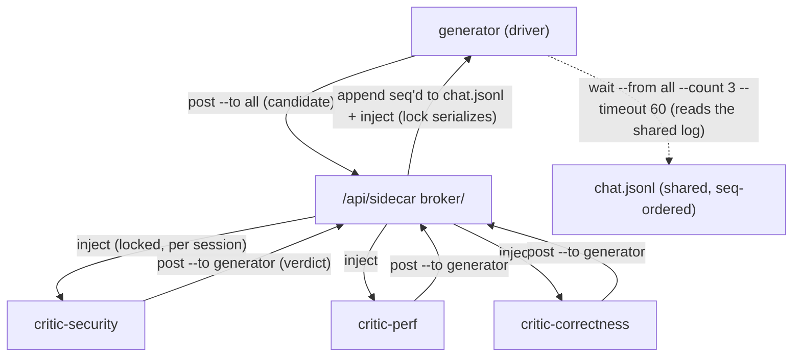

# Sidecar Multi-Peer (fan-out) - Plan

> Builds directly on the shipped sidecar v1 (`docs/plans/2026-06-27-001-feature-sidecar-plan.md`,
> commit `46ac709`). Design reviewed by a live sidecar peer (Claude Opus 4.8) — its findings are
> folded into the KTDs, the two v1 bug-fixes (U1), and the build/don't-build line.

## Goal Capsule

- **Objective:** Extend a sidecar from one driver + one peer to **one driver + N peers in a single shared group** (fan-out), with broadcast addressing and a generator-owned collection barrier — the substrate for a generator ↔ N-evaluators (judge-panel / reflexion) loop.
- **Product authority:** Allan.
- **Framing correction:** This is **not** a GAN (no gradients, no fixed weights, no discriminator state). It is a **judge-panel / reflexion loop**: stateless evaluators return structured verdicts, the generator revises. That framing is load-bearing — it means the substrate only needs **address + collect**, never score-normalization or discriminator state. Don't build GAN machinery.
- **Open blockers:** None. Two design forks are parked in Open Questions (mid-generation injection; per-message delivery status).

## Problem

v1 pairs exactly two members. The valuable next shape is **fan-out**: a generator broadcasts a candidate to N independent-context critics (each a persistent, resumable, human-inspectable session) and collects their verdicts. The data model already supports it (`members` is a list addressed by role name) and the per-session send lock already makes concurrent injection safe — but the create route spawns exactly one peer, addressing is point-to-point only, message ordering ties under fan-in, and concurrent group mutations can clobber. This plan closes that gap.

**Why sidecar and not `Workflow` parallel():** the in-process `Workflow` fan-out is better for fire-and-forget. Sidecar's only real edge is **persistent, resumable, human-inspectable tmux sessions in the GUI** — so this is positioned for *long-lived, human-in-the-loop panels*, not batch jobs. Do not rebuild Workflow's batching here.

## Key Technical Decisions

- **KTD1 — Addressing: role, comma-list, or `all`. No rooms/topics.** The *group* is already the room and the *role* is already the address; a second naming layer has no consumer (YAGNI). `--to <role>`, `--to a,b`, and `--to all` (sugar for "every other member"). **`all` must exclude the sender** or a generator broadcasts to itself and livelocks. Transport stays dumb — "peers reply to the driver only, not to each other" is a **priming convention**, not enforced by the broker.
- **KTD2 — Disambiguation ladder, plus group-at-birth for peers.** Resolution order: (i) explicit `--group` wins; (ii) else active groups containing the sender; (iii) exactly one → use it; (iv) more than one *and* `--to <role>` → filter to groups containing that role, if exactly one use it; (v) else error listing candidates. **The real fix:** a *spawned* peer is in exactly one group at birth, so it never disambiguates — only a human driver who joined multiple groups ever needs `--group`. The CLI also honors a `SIDECAR_GROUP` env/hint if present.
- **KTD3 — Fan-in is an app-layer barrier, not transport batching.** "When is the batch complete?" has no good transport answer. Replies are already labeled (`formatInbound` prefixes `[sidecar message from <role>]`) and the shared `chat.jsonl` *is* the collection buffer. The generator posts the candidate, then **reads the thread until N verdicts land or a deadline passes**, then synthesizes. Add the primitives `sidecar read --since <seq> --from <role>` and `sidecar wait --from <role|all> --count N --timeout S`. Do not build broker-side merge/batching.
- **KTD4 — Semantic role names, enforced unique and shell-safe.** A panel's whole value is *differentiated lenses* (`critic-security`, `critic-perf`, `critic-correctness`); `peer1/peer2` throws that away and blinds synthesis. Roles are addresses → unique per group, no spaces/quotes (they're CLI args). `create` takes `peers: [{role, task, agent}]` so each peer gets a **role-specific rubric** in its priming — that's the per-evaluator instruction channel.
- **KTD5 — Two v1 bugs fixed here (surfaced by the peer review).** (a) `appendMessage` orders on `Date.now()` — millisecond ties are likely under fan-in → add a **monotonic per-group `seq`**. (b) `writeGroups()` rewrites the whole file → two concurrent peer-joins can clobber a member → **serialize create/mutate with `createKeyedLock`** (already in `lib/sendlock.js`).
- **KTD6 — Verdict schema stays a priming convention, never broker-enforced.** The aggregation policy (majority / weighted / veto) lives in the **generator's prompt/skill**, not the broker — baking it in would fork sidecar from being general. The broker only addresses and collects.

## High-Level Technical Design

The loop = **address (fan out candidate) → collect (poll the shared seq'd log for N verdicts) → synthesize (in the generator)**. Everything the loop needs is already in the substrate once seq ordering and `all`/`wait` exist.

## Implementation Units

### U1. Concurrency-safe store: monotonic seq + role validation + mutate lock

- **Goal:** Make the group store correct under fan-in and concurrent joins.
- **Requirements:** KTD5; foundation for ordered collection (KTD3) and N-peer joins (U2).
- **Dependencies:** none.
- **Files:** `lib/sidecar.js`, `lib/sendlock.js` (reuse), `test/unit/sidecar.test.js`.
- **Approach:** Add a per-group monotonic `seq` (persisted on the group; `appendMessage` increments it and stamps each message with `seq`). Add `addMember(id, member)` / `removeMember(id, role)` with **unique + shell-safe** role validation (reject duplicates, spaces, quotes). Wrap all registry mutations (`createGroup`, `addMember`, `removeMember`, `teardownGroup`) in a `createKeyedLock()` keyed on `'groups'` so concurrent `writeGroups` can't clobber. Keep `appendMessage` writes per-group-file (already append-only) but draw `seq` under the same lock.
- **Patterns to follow:** existing `readGroups/writeGroups`; `createKeyedLock` from `lib/sendlock.js`.
- **Test scenarios:**
  - `appendMessage` stamps strictly increasing `seq` even when two appends share a `Date.now()` value.
  - `addMember` rejects a duplicate role and a role containing a space or quote.
  - Two concurrent `addMember` calls on the same group both persist (no lost member) — assert final member count.
  - `removeMember` drops the member and leaves others intact.
- **Verification:** unit tests green; a burst of appends yields contiguous, ordered `seq`.

### U2. N-peer create, roster-aware priming, peer lifecycle

- **Goal:** Spawn a group with N peers (and add/remove peers later), each primed with the full roster and its own rubric.
- **Requirements:** KTD1, KTD2, KTD4; the fan-out shape.
- **Dependencies:** U1.
- **Files:** `server.js` (`/api/sidecar*` routes), `lib/sidecar.js` (`priming`).
- **Approach:** Extend `POST /api/sidecar` to accept `peers: [{role, task, agent}]` (default one `peer` when omitted, preserving v1) — spawn each via `spawnSession`, register all as members, delayed-prime each. Add `POST /api/sidecar/:id/peers` (add+spawn one) and `POST /api/sidecar/:id/peers/:role/delete` (kill that peer's tmux + `removeMember`). Rewrite `priming()` to take the **roster** (all member roles) + `selfRole` + per-role `task`: it enumerates who else is in the group and explains `--to <role>` and `--to all`. **GC:** when a post can't resolve because the driver tmux is gone, tear the group down and kill orphaned spawned peers (check `tmuxIsActive` on the driver).
- **Patterns to follow:** v1 create route + delayed-prime; `spawnSession` (`server.js:598`); existing per-member `spawned` flag for teardown.
- **Test scenarios:**
  - `POST /api/sidecar` with three `peers` registers a 4-member group (driver + 3) with unique roles; duplicate roles → 400.
  - `priming` output enumerates the other roles and mentions `--to all` and the member's own task.
  - `POST /api/sidecar/:id/peers` adds and primes one peer; `.../peers/:role/delete` removes it and kills its tmux.
  - Group GC: with the driver tmux gone, a post triggers teardown and kills spawned peers.
- **Verification:** spawn a 3-critic panel via curl; all three appear in `/api/sessions`; each is primed with the roster.

### U3. Multi-recipient addressing + broadcast in the broker

- **Goal:** Deliver one post to a role, a comma-list, or all-others.
- **Requirements:** KTD1, KTD3 (labeling), KTD6.
- **Dependencies:** U1.
- **Files:** `lib/sidecar.js` (`resolveRecipients`), `server.js` (`sidecarDeliver`, post routes).
- **Approach:** Add `resolveRecipients(group, to, senderRole)` → member list: single role → `[member]`; comma-list → those members; `all` → **all members except the sender**. `sidecarDeliver` takes the resolved list: append **one** seq'd message (`to` normalized, e.g. `"all"` or the csv), broadcast over SSE, then inject into **each** recipient via the locked `sendInput` (the per-session lock already serializes concurrent fan-in into any one session). Unknown role in the list → 400 naming it. The post routes pass `senderRole` (from `fromPrefix`/`from`) so `all` can exclude the sender.
- **Patterns to follow:** v1 `sidecarDeliver`; `formatInbound` (already labels sender).
- **Test scenarios:**
  - `--to all` from `critic-security` injects into the driver and the other critics but **not** back into `critic-security`.
  - `--to critic-perf,critic-correctness` injects into exactly those two; one message appended with `seq`.
  - Unknown role in a comma-list → 400 naming the bad role; nothing injected.
  - Concurrent verdicts from three critics to the driver all land intact (lock; integration with U1 seq ordering).
- **Verification:** broadcast a message to a 3-critic panel; each non-sender pane receives it once; `chat.jsonl` has one seq'd entry.

### U4. CLI: addressing, disambiguation, and the collection primitives

- **Goal:** Drive multi-peer panels and let the generator collect verdicts from the shared log.
- **Requirements:** KTD1, KTD2, KTD3.
- **Dependencies:** U3.
- **Files:** `bin/sidecar`.
- **Approach:** `post --to <role|a,b|all>`; add `--group <id>` and honor `SIDECAR_GROUP` env; implement the KTD2 resolution ladder (error lists candidate groups when ambiguous). Add collection primitives: `read --since <seq> --from <role>` (filter the thread) and `wait --from <role|all> --count <N> --timeout <S>` — poll `GET /api/sidecar/:id` until N matching messages with `seq` greater than the call's starting max land, or timeout (bounded; prints what it got and exits non-zero on timeout). Keep self-ID via tmux name; port auto-detect from v1.
- **Patterns to follow:** v1 `bin/sidecar` (self_prefix, resolve_base, jq usage).
- **Test scenarios** *(shell-level, against a seeded test server like v1's e2e):*
  - `post --to all` excludes self; `post --to a,b` hits both.
  - Ambiguous sender (in two groups) without `--group` → error listing candidates; with `--group` → resolves.
  - `wait --from all --count 2 --timeout 5` returns once two fresh verdicts land; times out non-zero if not.
  - `read --since <seq> --from critic-perf` prints only that critic's later messages.
- **Verification:** a scripted generator can fan out and block on `wait` until the panel responds.

### U5. GUI: multi-member panel

- **Goal:** Render an N-member panel and manage peers.
- **Requirements:** the GUI panel, extended to N.
- **Dependencies:** U2, U3.
- **Files:** `frontend/src/components/Sidecar.tsx`, `frontend/src/api.ts`.
- **Approach:** Render the multi-party thread (already `from → to`; show `to: all` clearly and color/badge by sender role). Roster shows all members with per-peer "open" and "remove" controls and an "add peer" affordance (role + task + agent). Add a broadcast compose (`--to all`). `api.ts`: `addSidecarPeer`, `removeSidecarPeer`, and allow `to` to be a role, csv, or `all` in `postSidecar`.
- **Patterns to follow:** v1 `Sidecar.tsx` + `api.ts`.
- **Test scenarios:** `Test expectation: none -- UI wiring; covered by manual verification + U2/U3 backend tests.`
- **Verification:** spawn a 3-critic panel from the GUI, broadcast a message, watch three labeled verdicts stream into the thread.

### U6. Skill + docs

- **Goal:** Document multi-peer / judge-panel usage and the reflexion-loop framing.
- **Requirements:** entry point + correct mental model.
- **Dependencies:** U2–U4.
- **Files:** `skills/sidecar/SKILL.md`.
- **Approach:** Document `peers:[{role,task}]` create, `--to all`/comma-list, `wait`/`read --since`, and a worked **judge-panel** example (generator + 3 critics → fan out → `wait --from all --count 3` → synthesize). State plainly: verdict **schema is a priming convention** (show an example rubric), aggregation policy lives in the generator, and sidecar is for **long-lived human-in-the-loop panels** (use `Workflow` for fire-and-forget fan-out). Note the trust boundary (KTD: `fromPrefix` is self-asserted — fine in this single-user container).
- **Test scenarios:** `Test expectation: none -- documentation.`
- **Verification:** following the skill's judge-panel example produces a collected, synthesized result.

## Verification Contract

- **Automated:** U1 (seq monotonicity, role validation, concurrent-join no-clobber), U3 (`all` excludes sender, comma-list, unknown-role 400), U4 (`wait`/`read --since` semantics) in `test/unit/sidecar.test.js` + a seeded shell e2e mirroring v1.
- **Manual e2e:** spawn a 3-critic panel, broadcast a candidate, generator `wait --from all --count 3 --timeout 60` collects three labeled, seq-ordered verdicts and synthesizes; remove one peer; GC fires when the driver dies.

## Risks & Open Questions

- **OQ1 — Mid-generation injection (the biggest real-world loop risk).** The send lock protects *bytes*, not "the agent is mid-turn." A verdict pasted into the driver while it's generating can interleave with its own output. v1 deliberately chose **blast-anytime** (user's call) and that's fine for interactive chat — but an automated loop wants a **per-recipient hold-until-idle** (idle detection already exists ~`server.js:498`). **Decision deferred:** keep blast-anytime as default; add an *optional* per-recipient idle-hold for loop mode in a later increment. Do not silently change v1 behavior.
- **OQ2 — Per-message delivery status.** `sendInput` is fire-and-forget and swallows failure (a dormant peer → message recorded but never delivered). Recommendation (small): record `delivered`/`failed` per message and lean on `chat.jsonl` as the source of truth that agents can re-read. Include if cheap; otherwise defer with a note.
- **Self-asserted identity:** `fromPrefix` is spoofable — any local process can post as any role. Acceptable inside this single-user container; documented as a known boundary, not hardened.
- **`chat.jsonl` unbounded** over a long loop — fine at current scale; note for later rotation.

### Explicitly NOT in this plan (keep it general)
- Transport-level fan-in batching/merge (app-layer poll instead — KTD3).
- Rooms/topics, peer-mesh routing beyond `all`.
- Aggregation policy (majority/weighted/veto) — lives in the generator's prompt/skill, not the broker (KTD6).
- Auth hardening; any persistence beyond flat files.
- GAN machinery (discriminator state, score normalization) — wrong model (it's a reflexion/judge-panel loop).

## Definition of Done

- One driver + N peers in a single group; peers spawnable at create and add/removable after.
- `--to <role>`, `--to a,b`, and `--to all` (excluding sender) all deliver correctly; messages carry monotonic `seq`.
- A generator can fan out and **collect**: `sidecar wait --from all --count N --timeout S` blocks on the shared log and returns the N labeled verdicts.
- Concurrent group joins don't clobber; concurrent verdicts don't garble (lock) and order by `seq`.
- GUI renders the multi-member panel with add/remove + broadcast.
- Skill documents the judge-panel/reflexion framing; verdict schema is a priming convention, not broker-enforced.
- Unit + e2e tests green.

## Sources & Research

- Builds on `docs/plans/2026-06-27-001-feature-sidecar-plan.md` and shipped code (`lib/sidecar.js`, `lib/sendlock.js`, `bin/sidecar`, `server.js` `/api/sidecar*`, `frontend/src/components/Sidecar.tsx`).
- **Design review by a live sidecar peer** (Claude Opus 4.8, independent context) — read v1 end-to-end and contributed: the addressing refinements (comma-list, `all`-excludes-sender), the disambiguation ladder + group-at-birth, app-layer barrier over transport batching, the two v1 bug-fixes (seq ordering, mutate lock), semantic role names, the edge-case list (mid-generation injection, silent delivery loss, orphaned peers, identity boundary), and the GAN→reflexion framing correction. Dogfooded via the feature itself.
